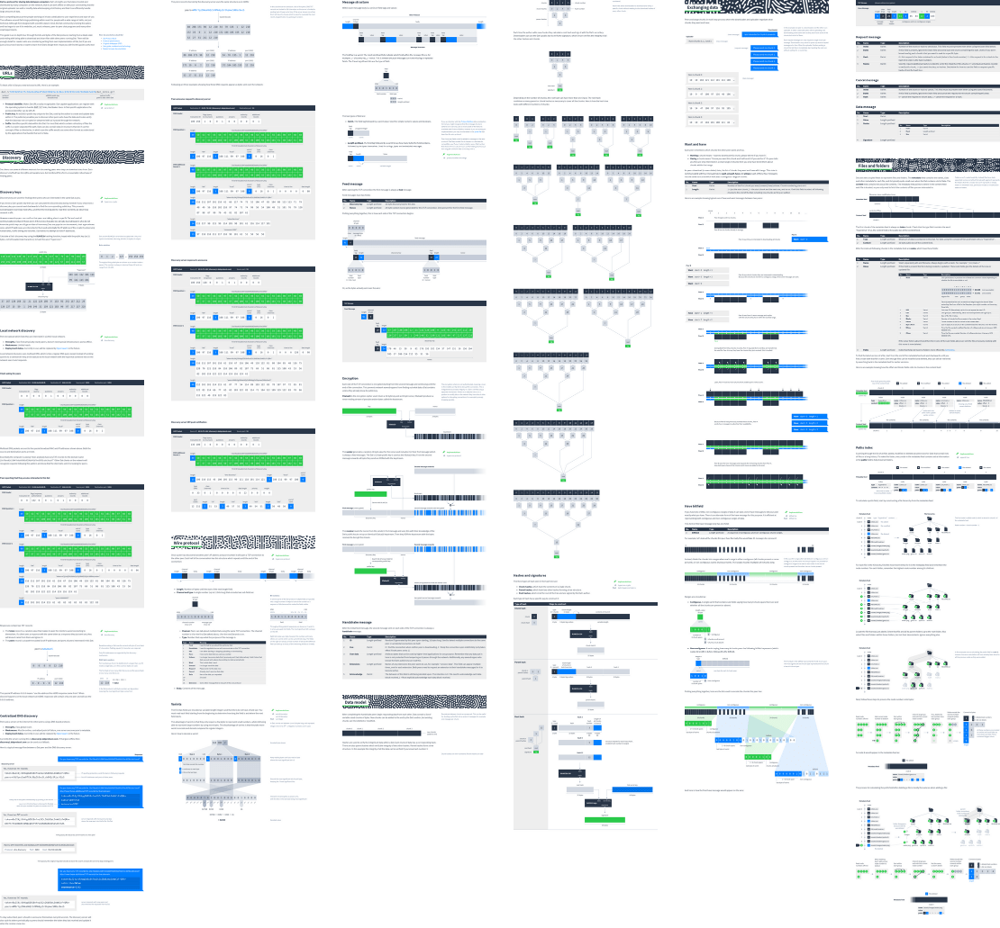

# How Dat Works

[**Read online**](https://vtduncan.github.io/how-dat-works/)

A walk through the bits and bytes of Dat’s network protocol. Lots of pictures, just enough words.

**Work-in-progress.** Preparing for v1 release on 22 Jan 2019.

## Contributing

For feedback, minor corrections and amendments please either [mail me](mailto:duncan@fastmail.com), open an issue or make a pull request.

For larger changes such as adding a new section, please mail me or open an issue first so I can get an idea of what you have in mind. This lets me make sure it’s a change that will be accepted later on and also lets me work with you on it. Thanks!

## Public Domain

This documentation is dedicated to the public domain. Please use it in any way that you wish!
